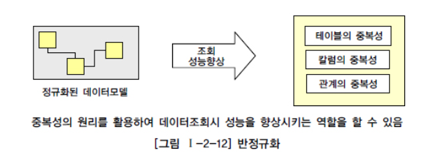
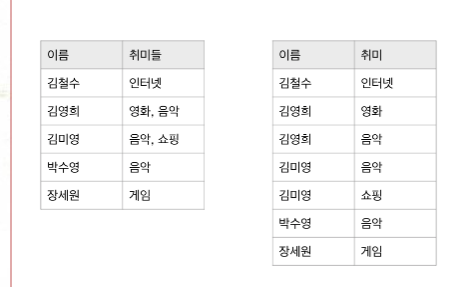
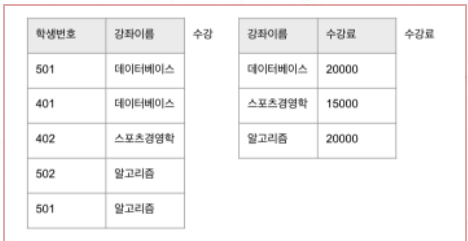
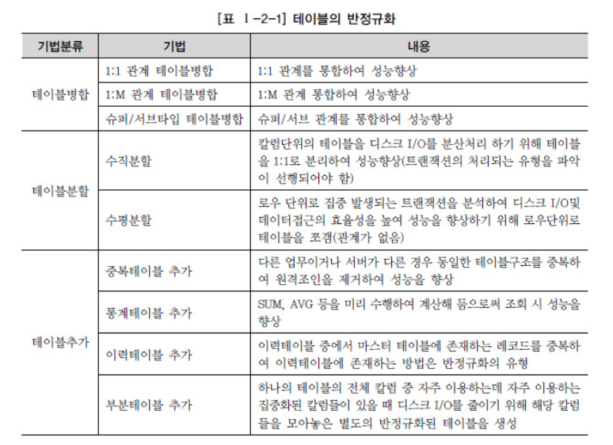
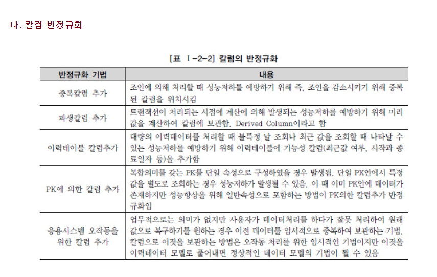
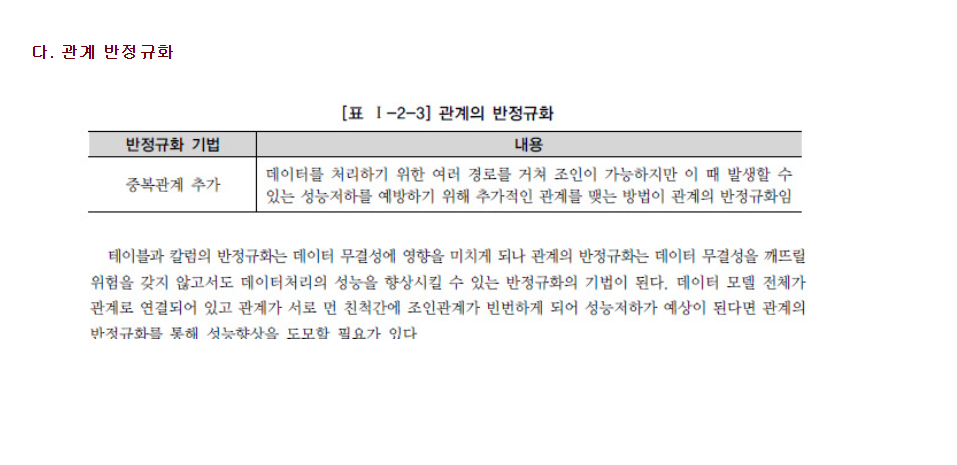

# 데이터 모델과 성능/~p34

## 1-2 데이터 모델과 성능

### i) 트랜잭션

- 데이터베이스의 상태를 변화시키기 위해서 수행하는 작업의 단위
- 간단하게 말해서 아래의 질의어(SQL)를 이용하여 데이터베이스를 접근 하는 것을 의미
  - SELECT
  - INSERT
  - DELETE
  - UPDATE

### ii) 성능 데이터 모델링

- 데이터베이스 성능 향상을 목적으로 설계단계의 데이터 모델링 때부터 성능과 관련된 사항이 데이터 모델링에 반영될 수 있도록 하는 것

### iii) 반정규화(역정규화)

- 성능을 향상시키기 위해 정규화된 데이터 모델에서 중복, 통합, 분리 등을 수행하는 모든 과정을 의미
- 반정규화 방법에는 테이블 통합, 테이블 분할, 중복 테이블 추가, 중복 속성 추가 등이 있다.

##### 

> 함수종속성(FD) : DB에서 속성들간 종속 관계를 말함

### iv) 성능을 고려한 데이터 모델링의 순서

1. 데이터모델링을 할 때 정규화를 정확하게 수행한다.
2. 데이터베이스 용량산정을 수행한다.
3. 데이터베이스에 발생되는 트랜잭션의 유형을 파악한다.
4. 용량과 트랜잭션의 유형에 따라 반정규화(역정규화)를 수행한다.
5. 이력모델의 조정, PK/FK조정, 슈퍼타입/서브타입 조정 등을 수행

### v) 정규화 (n차 정규화)

- 테이블 간에 중복된 데이터를 허용하지 않는다
- 무결성을 유지할 수 있으며, DB의 저장 용량 역시 줄일 수 있다.

1.  제 1정규화
   1. 테이블의 컬럼이 원자값을 갖도록 테이블을 분해하는 것이다.
2. 제 2 정규화
   1. 제 1정규화를 진행한 테이블에 대해 완전 함수 종속을 만족하도록 테이블을 분해하는 것

> 완전 함수 종속 : 기본키가 종속자이며 기본키가 여러 속성으로 구성되어 있을 경우 기본키를 구성하는 모든 속성이 포함된 부분집합 또한 종속자일 경우를 말함
>
> 예) 한번이라는 결정자는 학부,이름을 종속하고 있다.

3. 제 3정규화
   1. 제 2정규화를 진행한 테이블에 대해 이행적 종속을 없애도록 테이블을 분해하는 것
   2. 예를 들어 수강과 수강료 테이블이 합쳐져 있다면, 501번 학생이 수강하는 강좌 이름이 바뀔 때마다 해당 강좌 이름만 바뀔 뿐, 수강료는 바뀌지 않는다, 물론 강좌 이름에 맞게 수강료를 다시 변경할 수 있지만, 번거로움을 해결하기 위해 제 3정규화를 하는 것이다.

### vi) 반정규화 기법

- 테이블의 반정규화

- 칼럼의 반정규화

- 관계의 반정규화

### vii) 반정규화 절차

1. 반정규화 대상조사
   - 범위처리빈도수 조사
   - 대량의 범위 처리 조사
   - 통계성 프로세스 조사
   - 테이블 조인 개수
2. 다른 방법유도 검토
   - 뷰(VIEW) 테이블
   - 클러스터링 적용
   - 인덱스의 조정
   - 응용애플리케이션
3. 반정규화 적용
   - 테이블 반정규화
   - 속성의 반정규화
   - 관계의 반정규화

### viii) 반정규화의 대상에 대해 다른 방법으로 처리

- 지나치게 많은 조인이 걸려 데이터를 조회하는 작업이 기술적으로 어려울 경우 뷰를 사용하면 이를 해결할 수 도있다.
- 대량의 데이터처리나 부분처리에 의해 성능이 저하되는 경우에 클러스터링을 적용하거나 인덱스를 조정함으로써 성능을 향상 시킬 수 있따.
- 대량의 데이터는 Primary Key의 성격에 따라 부분적인 테이블로 분리할 수 있다. 즉 파티셔닝 기법이 적용되어 성능저하를 방지 할 수 있다.
- 응용 애플리케이션에서 로직을 구사하는 방법으로 변경함으로써 성능을 향상시킬 수 있다.

### ix) 슈퍼/서브 타입 데이터 모델

- Extended ER모델이라고도 부른다
- 공통 부분을 슈퍼타입으로 모델링하고, 공통부분으로부터 상속받아 다른엔티티와 차이가 있는 속성에 대해서는 별도의 서브엔터티로 구분하여 업무의 모습을 정확하게 하면서 물리적인 데이터 모델로 변환을 할 때 선택의 폭을 넓힐 수 있다.
- 슈퍼/서브 타입 데이터 모델의 변환기술
  - 개별로 발생되는 트랜잭션에 대해서는 개별 테이블로 구성
  - 슈퍼타입+서브타입에 대해 발생되는 트랜잭션에 대해서는 슈퍼타입+서브타입 테이블로 구성
  - 전체를 하나로 묶어 트랜잭션이 발생할 때는 하나의 테이블로 구성

### x) 분산 데이터베이스

- 물리적으로 분산되어 있는 데이터를 네트워크를 통해 논리적으로 동일한 시스템에서 하나의 데이터베이스처럼 이용하는 기술, 그 기술로 구현된 데이터베이스
- 장점
  - 지역 자치성, 점증적 시스템 용량 확장
  - 신뢰성과 가용성
  - 효용성과 융통성
  - 빠른 응답 속도와 통신비용 절감
  - 데이터의 가용성과 신뢰성 증가
  - 시스템 규모의 적절한 조절
  - 각 지역 사용자의 요구 수용 증대
- 단점
  - 소프트웨어 개발 비용
  - 오류의 잠재성 증대
  - 처리 비용의 증대
  - 설계, 관리의 복잡성과 비용
  - 불규칙한 응답 속도
  - 통제의 어려움
  - 데이터 무결성에 대한 위협

#### ★문제풀이 (오답노트)

##### ㉜ 반정규화(역정규화)

- 성능을 향상시키기 위해 정규화된 데이터 모델에서 중복, 통합, 분리 등을 수행하는 모든 과정을 의미
- 반정규화 방법에는 테이블 통합, 테이블 분할, 중복 테이블 추가, 중복 속성 추가 등이 있다.

##### ㊱ 정규화

- 테이블 간에 중복된 데이터를 허용하지 않는다
- 무결성을 유지할 수 있으며, DB의 저장 용량 역시 줄일 수 있다.

1.  제 1정규화
   1. 테이블의 컬럼이 원자값을 갖도록 테이블을 분해하는 것이다.
2. 제 2 정규화
   1. 제 1정규화를 진행한 테이블에 대해 완전 함수 종속을 만족하도록 테이블을 분해하는 것

> 완전 함수 종속 : 기본키가 종속자이며 기본키가 여러 속성으로 구성되어 있을 경우 기본키를 구성하는 모든 속성이 포함된 부분집합 또한 종속자일 경우를 말함
>
> 예) 한번이라는 결정자는 학부,이름을 종속하고 있다.

##### ㊴ 1차 정규화의 대상

- 중복속성에 대한 분리
- 로우 단위의 중복
- 컬럼 단위로 중복

##### ㊵반정규화를 고려할 때 판단요소에 대한 설명

- 반정규화 정보에 대한 재현의 적시성으로 판단한다. 예를 들어 빌링의 잔액은 다수 테이블에 대한 다량의 조인이 불가피하므로 데이터 제공의 적시성 확보를 위한 필수 반정규화 대상 정보이다.
- 다량의 데이터 탐색의 경우 인덱스가 아닌 파티션 및 데이터 클러스터링 등의 다양한 물리 저장 기법을 활용하여 성능 개선을 유도할 수 있다. 다만, 하나의 결과셋을 추출하기 위해 다량의 데이터를 탐색하는 처리가 반복적으로 빈번하게 발생한다면 이때는 반정규화를 고려하는 것이 좋다.
- 이전 또는 이후 위치의 레코드에 대한 탐색은 window function으로 접근 가능하다.
- 집계 테이블 이외에도 다양한 유형(다수 테이블의 키 연결 테이블 등)에 대하여 반정규화 테이블 적용이 필요할 수 있다.

##### ㊶하나의 테이블의 전체 칼럼 중 자주 이용하는 집중화된 칼럼들이 있을 때 디스크 I/O를 줄이기 위해 해당 칼럼들을 별도로 모아놓는 반정규화 기법

- 테이블추가- 부분테이블추가

##### ㊷ FK에 대한 속성 추가는 반정규화 기법이라기 보다는 데이터 모델링에서 관계를 연결할 때 나타나는 자연스러운 현상이다.

##### ㊸ 반정규화 방법 예

- 주문 목록 엔터티에 단가를 합한 계산된 칼럼을 추가

##### ㊹ 최근에 변경된 값만을 조회할 경우 과도한 조인으로 인해 성능이 저하되어 나타난다.

##### ㊻ 파티셔닝

- 하나의 테이블에 많은 양의 데이터가 저장되면 인덱스를 추가하고 테이블을 몇 개로 쪼개도 성능이 저하되는 경우가 있다. 이때 논리적으로는 하나의 테이블이지만 물맂거으로는 여러 개의 테이블로 분리하여 데이터 액세스 성능도 향상시키고, 데이터 관리방법도 개선할 수 있도록 테이블에 적용하는 기법

##### ㊼ UNION/UNION ALL

- 두 개 이상의 SQL 쿼리문을 합치는 방법

- UNION ALL 연산자는 각각에 쿼리에서 나온 데이터를 하나로 합쳐주는 역할을 하고 있으며, 중복되는 값도 그대로 출력이 된다
- UNION은 중복되는 부분은 하나에 로우로만 출력이 된다.
- UNION 연산자를 사용할 시에는 각 쿼리에 컬럼 갯수 및 명칭을 맞춰줘야 되며 그렇지 않으면 오류가 발생하는 것을 볼 수 있다.

##### ㊽ 논리데이터 모델의 슈퍼타입과 서브타입 데이터 모델을 물리적인 테이블 형식으로 변환할 때 설명

- 트랜잭션은 항상 전체를 통합하여 분석처리하는데 하나로 통합되어 있으면 데이터 집적으로 인해 성능이 저하될 수 있다.(X)

##### 52. Global Single Instance(GSI)

- 통합된 한 개의 인스턴스 즉, 통합 데이터 베이스 구조를 의미하므로 분산데이터베이스와는 대치되는 개념이다.
