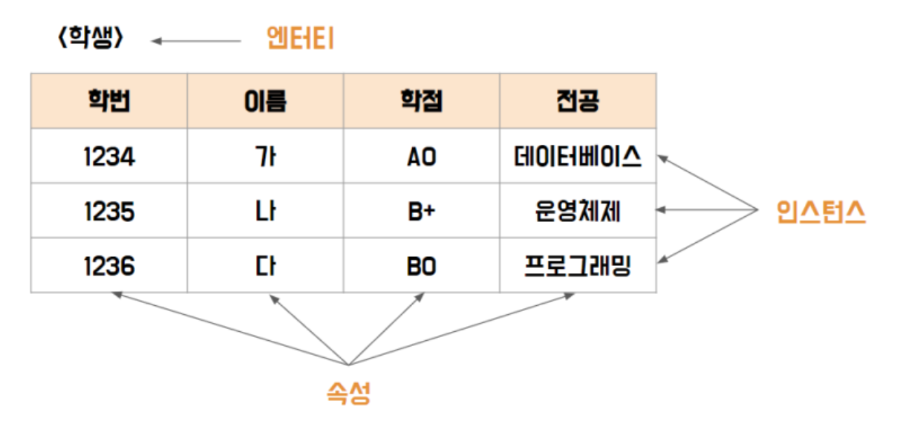

# 데이터 베이스 모델링/~p18

## 1-1 데이터 베이스 모델링

> 좋은 노래 Go Blind - spring gang
>
> 속성문제 대다수 틀림

### i) 데이터모델링 개념

- 개념적 데이터 모델링
  - 추상화 수준이 높고 업무중심적이고 포괄적인 수준의 모델링 진행, 전사적 데이터 모델링, EA수립시 많이 이용
- 논리적 데이터 모델링
  - 시스템으로 구축하고자 하는 업무에 대해 Key, 속성, 관계 등을 정확하게 표현, 재사용성이 높음
- 물리적 데이터 모델링
  - 실제로 데이터베이스에 이식할 수 있도록, 성능, 저장 등 물리적인 성격을 고려하여 설계

### ii) 스키마 구조

- 외부스키마 = 사용자 뷰
  - 사용자나 응용프로그래머가 각 개인의 입장에서 필요로 하는 데이터베이스의 논리적 구조를 정의한 것
  - 서브 스키마라고도 한다.
  - 하나의 데이터베이스 스시템에는 여러개의 외부 스키마가 존재 할 수 있다.
  - 하나의 외부 스키마를 여러개의 응용 프로그램이나 사용자가 공용할 수도 있다.
- 개념스키마 = 전체적인 뷰
  - 개념 스키마는 데이터베이스의 전체적인 논리적 구조로서, 모든 응용 프로그램이나 사용자들이 필요로 하는 데이터를 종합한 조직 전체의 데이터베이스 하나만 존재
  - 모든 응용시스템들이나 사용자들이 필요로 하는 데이터를 통합한 조직 전체의 DB를 기술한 것으로 DB에 저장되는 데이터와 그들간의 관계를 표현하는 스키마
- 내부스키마 = 저장 스키마
  - 물리적인 저장장치의 입장에서 본 데이터베이스 구조로, 물리적인 저장장치와 밀접한 계층

### iv) 엔터티의 특징

- 반드시 해당 업무에서 필요하고 관리하고자 하는 정보여야 한다. (예. 환자, 토익의 응시횟수, ...)\
- 유일한 식별자에 의해 식별이 가능해야 한다
- 객체지향의 디자인패턴에는 싱글턴패턴이 있어 하나의 인스턴스를 가지는 클래스가 존재한다.이와 유사하게 엔터티는 한 개의 인스턴스를 가지는 것만으로도 충분한 의미를 부여할 수 있다.(X)
- 영속적으로 존재하는 (두 개 이상의) 인스턴스의 집합이어야 한다.인스턴스란?

### v)엔터티, 인스턴스, 속성, 속성값 정의

- 엔터티 = 테이블
  - 업무에서 필요하고 유용한 정보를 저장하고 관리하기 위한 집합적인 것
- 속성 = 컬럼
  - 업무에서 필요로 하는 인스턴스로 의미상 더 이상 분리되지않는 최소의 데이터 단위
- 인스턴스 = 로우
  - 데이터베이스에 저장된 데이터 내용의 전체 집합을 의미

### vi) 속성의 명칭 부여

- 해당업무에서 사용하는 이름을 부여
- 서술식 속성명은 사용하지 않는다
- 약어사용은 가급적 제한
- 전체 데이터모델에서 유일성 확보하는 것이 좋다.

### vii) 관계의 표기법

- 관계명: 관계의 이름
- 관계차수: 1:1,1:M, M:N
- 관계선택사양 : 필수관계, 선택관계

### viii) 관계 읽기

- 기준 엔터티를 한 개 또는 각 으로 읽는다.
- 대상 엔터티의 관계참여도 즉 개수를 읽는다.
- 관계선택사양과 관계명을 읽는다

### ix) 두 개의 엔터티 사이에서 관계를 도출 할 때 체크 할 사항

- 두 개의 엔터티 사이에 관심있는 연관규칙이 존재하는가?
- 두 개의 엔터티 사이에 정보의 조합이 발생되는가?
- 업무기술서, 장표에 관계연결에 대한 규칙이 서술되어 있는가?
- 업무기술서, 장표에 관계연결을 가능하게 하는 동사(Verb)가 있는가?

### x)식별자의 종류

- 엔터니 내에서 대표성을 가지는가에 따라 주식별자와 보조식별자로 구분
- 엔터티 내에서 스스로 생성되었는지 여부에 따라 내부식별자와 외부식별자로 구분
- 단일 속성으로 식별이 되는가에 따라 단일식별자와 복합식별자로 구분
- 원래 업무적으로 의미가 있던 식별자 속성을 대체하여 일련번호와 같이 새롭게 만든 식별자를 구분하기 위해 본질 식별자와 인조식별자로 구분

### xi) 주식별자의 특징

- 유일성 : 주식별자에의해 엔터티내에 모든 인스턴스들을 유일하게 구분함
- 최소성: 주식별자를 구성하는 속성의 수는 유일성을 만족하는 최소의 수가 되어야 함
- 불변성: 주식별자가 한 번 특정 엔터티에 지정되면 그 식별자의 값은 변하지 않아야 함
- 존재성: 주식별자가 지정되면 반드시 데이터 값이 존재 (NULL) 안됨

### xii) 식별자와 비식별자

#### ★문제풀이 (오답노트)

##### ④ 데이터 모델링 시의 유의점

- 비유연성
  - 데이터 모델을 어떻게 설계했느냐에 따라 사소한 업무변화에도 데이터 모델이 수시로 변경됨으로써 유지보수의 어려움을 가중 시킬 수 있다.
  - 데이터의 정의를 데이터의 사용 프로세스와 분리한다
  - 작은 변화가 애플리케이션과 데이터베이스에 중대한 변화를 일으킬 수 있는 가능성을 줄인다.

##### ⑩ 엔터티의 특징

- 객체지향의 디자인패턴에는 싱글턴패턴이 있어 하나의 인스턴스를 가지는 클래스가 존재한다.이와 유사하게 엔터티는 한 개의 인스턴스를 가지는 것만으로도 충분한 의미를 부여할 수 있다.(X)

- 영속적으로 존재하는 (두 개 이상의) 인스턴스의 집합이어야 한다.

##### ⑬엔터티의 이름을 부여하는 방법

- 가능하면 현업언무에서 사용하는 용어
- 가능하면 약어를 사용하지 않는다 ★
- 단수명사를 사용한다.
- 모든 엔터티를 통틀어서 유일하게 이름이 부여되어야 한다,
- 엔터티 생성의미대로 이름을 부여

##### ⑭속성이란

- 업무에서 필요로 하는 인스턴스에서 관리하고자 하는 의미상 더 이상 분리되지 않는 최소의 데이터 단위

##### ⑮ 속성의 특징

- 엔터티에 대한 자세하고 구체적인 정보를 나타낸다.
- 하나의 엔터티는 두 개 이상의 속성을 갖는다.
- 하나의 인스턴스에서 각각의 속성은 한 개의 속성값을 가져야 한다.
- 속성도 집합이다.

##### ⑯⑰ 속성의 특성에 따른 분류

- 기본 속성
  - 사원이름, 직책이름, 고용일자 등 가장 일반적 속성
- 설계속성
  - 업무상 필요한 데이터 외에 데이터 모델리을 위해, 업무를 규칙화하기 위해 속성을 새로 만들거나 변형하여 정의하는 속성
  - 예) 인사팀, 영업팀
- 파생속성
  - 데이터를 조회할 때 빠른 성능을 할 수 있도록 하기 위해 속성의 값을 계산하여 저장할 수 있도록 만든 속성

##### ⑱도메인

- 각 엔터티의 속성에 대해서 어떤 유형의 값이 들어가는지를 정의하는 개념은 도메인에 해당함
- 각 속성은 가질 수 있는 값의 범위가 있는데 이를 그속성의 도메인 이라함

##### ㉕주식별자를 지정할 때 고려해야할 사항

- 주식별자에 의해 엔터티내에 모든 인스턴스들이 유일하게 구분되어야 한다.
- 주식별자를 구성하는 속성의 수는 유일성을 만족하는 최소의 수가 되어야 한다.
- 지정된 주식별자의 값은 자주 변하지 않는 것이어야 한다.
- 주식별자가 지정이 되면 반드시 값이 들어와야 한다.

##### ㉖인조식별자

- 사번은 업무적으로 의미 있는 식별자로 시스템적으로 부여된 인조식별자가 아니다.
- 본질식별자

##### ㉚비식별자 관계로 연결할때 고려해야 하는경우

- 부모엔터티에 참조값이 없어도 자식엔터티의 인스턴스가 생성될 수 있는 경우
- 여러 개의 엔터티를 하나로 통합하면서 각각의 엔터티가 갖고 있던 여러 개의 개별 관계가 통합되는 경우
- 자식쪽 엔터티의 주식별자를 부모엔터티와는 별도로 생성하는 것이 더 유리하다고 판단하는 경우